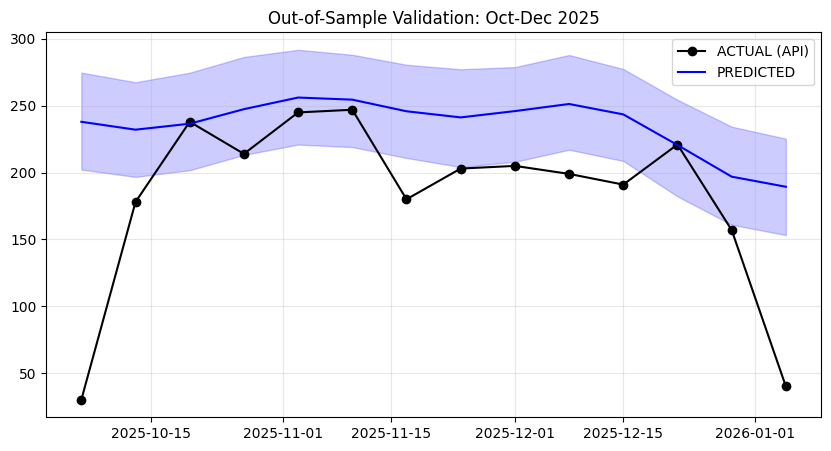

# Supply Risk Monitor: Predictive Blood Demand & Supply Forecasting  
### *Trauma-driven demand forecasting and supply risk early warning for Canada*


Blood products are highly perishable, making effective stockpile management critical. This project aims to build a "Control Tower" to forecast trauma-driven demand and identify potential supply risks.

---

## ⚠️ Problem Statement

Operational teams need earlier signals for blood shortage risks. The Supply Risk Monitor leverages national collision data and external factors to predict demand spikes caused by trauma events.

---

## 🚀 Current Status

The project has moved into the **Pipeline Implementation** phase.

### ✅ Implemented Features
*   **Data Ingestion**: Automated download and standardization of National Collision Database (NCDB) data from the Open Canada API.
*   **Forecasting Model**: **Finalized Baseline Facebook Prophet model**. The model has been trained and validated to capture trends and seasonality in collision data.
    
    

*   **Data Analysis**: Exploratory analysis notebooks for Toronto and NCDB datasets.
    
    
    *Annual Collision Trend showing historical patterns.*
    
    
    *Weekly aggregation revealing clear seasonality.*

### 🚧  Work in Progress
*   **Automated Retraining Pipeline**: Implementing a quarterly workflow that:
    1.  Fetches fresh Toronto collision data every 3 months.
    2.  Retrains the Prophet model with the updated dataset.
    3.  Generates demand forecasts for the next 3-month window.

---

## 📂 Project Structure

```
├── data/               # Raw and processed data
├── notebooks/          # Analysis and prototyping notebooks
│   ├── Analyze.ipynb   # Model analysis
│   ├── ingest_ncdb.ipynb # NCDB data ingestion
│   └── ...
├── src/                # Source code (currently undergoing refactoring)
│   ├── ingest/         # Data ingestion scripts/notebooks
│   ├── models/         # Forecasting models (Prophet)
│   └── transform/      # Data cleaning and transformation
└── ...
```

---

## 🛠️ Tech Stack

*   **Ingestion:** Python (Requests, Pandas)
*   **Modeling:** Facebook Prophet
*   **Data Manipulation:** Pandas
*   **Environment:** Jupyter Notebooks

---

## 🔧 Usage

Currently, the workflow is executed via Jupyter Notebooks:

1.  **Ingest Data**: Run `src/ingest/ingest_ncdb.ipynb` to download collision data.
2.  **Train Model**: Run `src/models/prophet_train.ipynb`.
3.  **Test Model**: Run `src/models/Final_Model_test.ipynb`.

---

## 🎯 Objectives (Future)

*   **Model Optimization**: Explore efficiency improvements and alternative algorithms to enhance the current Prophet model.
*   **Risk Metrics**: Operationalize the **Risk Coverage Ratio** for decision support.
