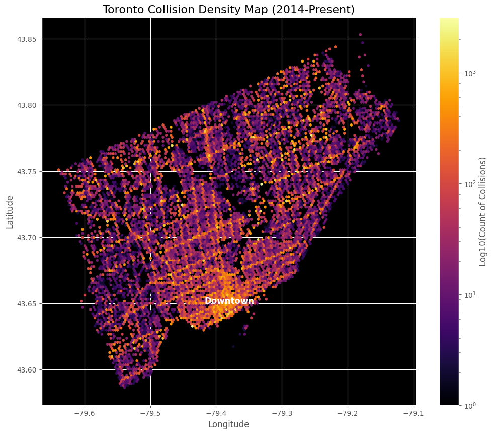

# Exploratory Data Analysis: Toronto Traffic Collision Data
## Urban Mobility Safety & Vulnerability Profile

This analysis examines collision patterns from the Toronto Police Service (TPS) Public Safety Data Portal to identify high-risk temporal windows, vulnerable road user dynamics, and "lethal hours" for Vision Zero planning.

---

## Executive Summary

The data reveals a distinct bifurcation between "high volume" congestion accidents and "high risk" lethal accidents:

- **The Congestion Problem**: The highest volume of collisions occurs during the weekday PM commute (3 PM – 6 PM), specifically peaking on Friday afternoons. This represents a predictable strain on emergency response resources due to traffic gridlock.
- **The Lethality Paradox**: While collision volume is lowest at 2:00 AM – 3:00 AM, the probability of injury peaks during these hours. The roads are empty, but the accidents that do happen are significantly more dangerous.
- **The Vulnerability Gap**: There is a massive disparity in outcomes. A pedestrian involved in a collision has an 82.9% chance of injury or death, compared to just 13.6% for vehicle occupants.

---

## Key Findings

### Temporal Dynamics: The "Commuter" vs. "Lethal" Clock

#### Long-Term Trend: The Pandemic Structural Break

**Observation**: A steady climb in collisions peaked in 2019 (>80,000), followed by a massive -50% structural break in 2020 due to COVID-19.

**Recovery Insight**: 2021–2024 shows a steady rebound, but volumes have not yet returned to pre-pandemic highs. *Note: The sharp drop in 2025 is an artifact of incomplete data (reporting ends Q3 2025).*

**Strategic Implication**: Traffic safety baselines must be reset. Using 2019 as a benchmark for 2025/2026 performance may yield false "success" metrics simply because commuter volume hasn't fully recovered.

#### Weekly Risk Pattern: The Friday Surge

**Observation**: Weekdays exhibit a classic "bimodal" pattern (Morning Rush 8-9 AM, Evening Rush 3-6 PM).

**The Friday Anomaly**: The Friday evening peak is wider and more intense than any other day, likely due to the convergence of commuter traffic and weekend recreational travel.

**Weekend Shift**: Saturday/Sunday lack a morning rush entirely, with risk diffused broadly from 11 AM to 6 PM.

**Resource Allocation**: Emergency response teams should be positioned for maximum density deployment on Friday afternoons.

#### Volume vs. Danger: The "Lethal Hours"

**Observation**: This dual-axis chart reveals a critical inverse relationship:
- **Grey Bars (Volume)**: Peak at 5:00 PM (Gridlock)
- **Red Line (Risk)**: Peaks at 2:00 AM – 3:00 AM (Speed)

**Critical Insight**: At 5:00 PM, accidents are frequent but minor (fender benders). At 3:00 AM, the injury rate jumps to nearly 18%. Empty roads allow for higher speeds, transforming minor errors into major trauma events.

---

### Vulnerability Profile: The User Hierarchy

#### The Vulnerability Index

**Observation**: The data quantifies the "steel cage" advantage.

| Road User Type | Injury Rate |
|----------------|-------------|
| Pedestrians    | **82.9%**   |
| Cyclists       | **74.7%**   |
| Motorcycles    | **37.4%**   |
| Automobiles    | **13.6%**   |

**Safety Implication**: A collision involving an automobile is a property insurance claim 86% of the time. A collision involving a pedestrian is a medical emergency 83% of the time.

#### Severity Distribution

**Observation**:
- Property Damage Only (PDO): **84.0%**
- Personal Injury: **15.9%**
- Fatal: **0.1%**

**Context**: While fatalities are statistically rare (0.1%), the 16% injury slice represents thousands of hospitalizations annually. The high PDO rate confirms that most Toronto collisions are low-speed congestion events.

---

### Geospatial Dynamics

#### Density & The "U" Shape

**Observation**: The hexbin density map reveals Toronto's infrastructure skeleton.

**Grid Structure**: The high-density "hotspots" (bright yellow/orange) perfectly trace the major arterial grid (e.g., Yonge St, Bloor St).

**Highway Corridors**: The Gardiner Expressway and DVP are clearly visible as continuous high-density ribbons.

**Strategic Insight**: Risk is not random; it is structural. High-frequency accident zones are baked into the design of specific intersections and arterial roads.

---

## Strategic Recommendations

### For Vision Zero Planning

1. **Targeted Enforcement**: Shift speed enforcement resources to the 2:00 AM – 4:00 AM window. While volume is low, these are the drivers causing the most severe trauma per capita.

2. **Infrastructure Priority**: Given the 82.9% injury rate for pedestrians, physical separation (barriers, distinct signal phases) is the only viable method to reduce trauma statistics. "Shared road" concepts fail when the vulnerability gap is this extreme.

3. **Friday Surge Protocols**: Hospital trauma units and EMS dispatch should anticipate peak weekly load between 15:00 and 19:00 on Fridays.

### For Predictive Modeling

1. **Mode-Specific Weighting**: Predictive models for "Trauma Demand" must weigh a Pedestrian collision 6x higher than an Auto collision based on the Vulnerability Index (82.9% vs 13.6%).

2. **Time-of-Day Features**: Models must distinguish between "Rush Hour" (High Count, Low Severity) and "Late Night" (Low Count, High Severity). A raw count of collisions is a poor proxy for injury severity.

---

## Data Sources and Methodology

**Dataset**: Toronto Police Service Public Safety Data Portal (Traffic Collisions), 2014–Present  
**Analysis Tools**: Python (pandas, matplotlib, seaborn, hexbin mapping)  
**Key Variables**: Occurrence Date, Hour, Involvement Type (Pedestrian/Cyclist/Auto), Injury/Fatality Flags, Geospatial Coordinates (WGS84)

---

## Repository Structure

