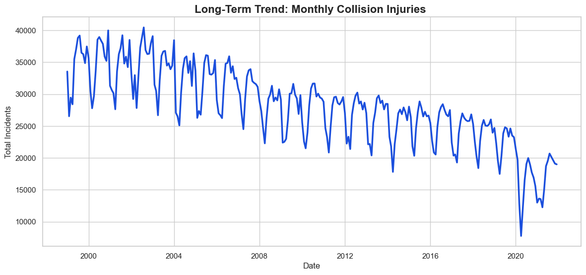
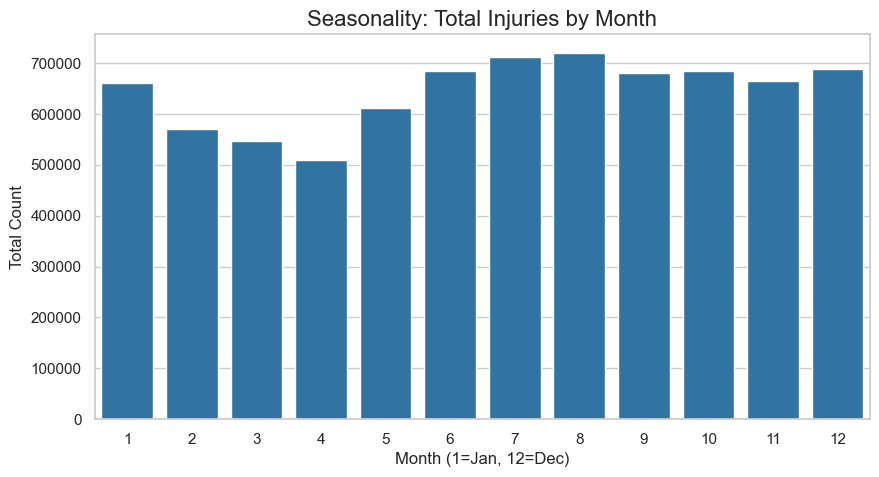
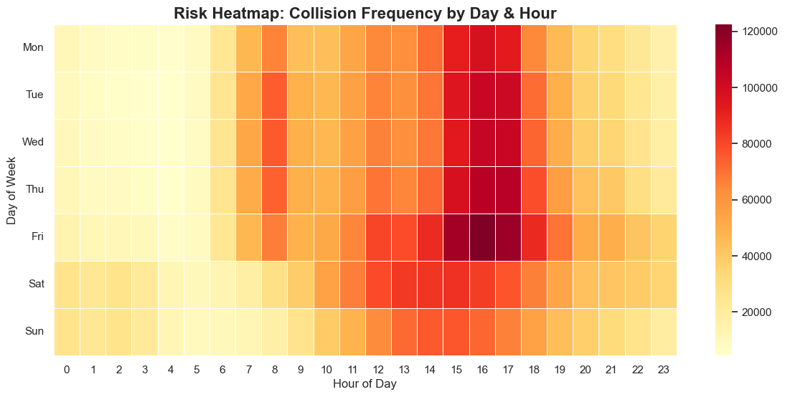
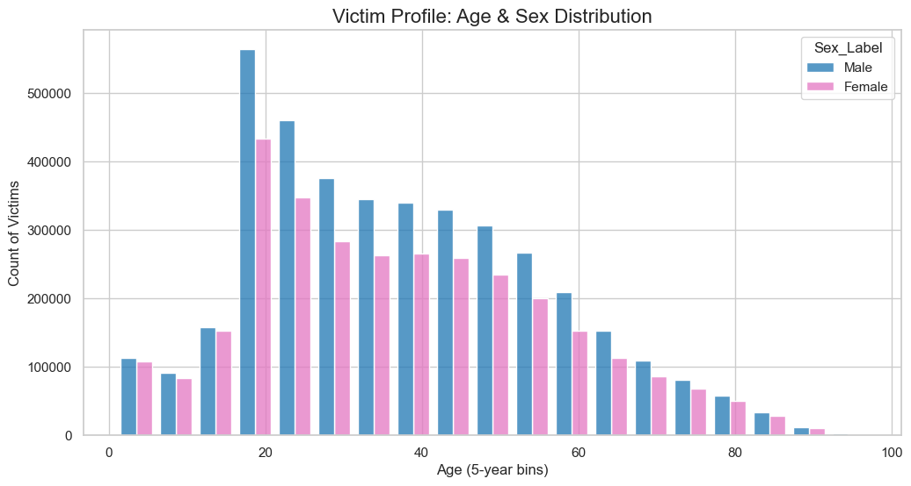

# Exploratory Data Analysis: National Collision Database
## Blood Supply Implications for Trauma Care

This analysis examines collision patterns from the National Collision Database (NCDB) to identify critical supply-demand misalignments for Canadian Blood Services trauma inventory management.

---

## Executive Summary

The data reveals a critical misalignment between typical blood donation patterns and trauma demand:

- **The Problem**: Trauma demand peaks in Summer and Late Autumn—precisely when donor attendance typically drops ("Summer Slump")
- **The Risk Zone**: The highest volume of potential trauma patients occurs on Friday afternoons (3 PM – 6 PM), creating a weekly pressure point for hospital inventory entering the weekend
- **The Patient Profile**: The primary demographic driver is Males aged 18–30. This group is statistically more likely to be involved in severe crashes and, due to average body size, may require higher volumes of blood products per transfusion than other demographics

---

## Key Findings

### Temporal Dynamics: When is the System Stressed?

#### Long-Term Trend: The "COVID Shock"

**Observation**: There is a steady, structural decline in collision injuries from 1999–2019, likely due to improved vehicle safety standards.

**Critical Anomaly**: The massive drop in 2020 represents the COVID-19 lockdowns and reduced traffic volume.

**Forecasting Implication**: Predictive models cannot treat 2020–2021 as "normal." This period must either be:
- Treated as an anomaly in time series forecasting
- Adjusted using control features like "vehicle kilometers traveled"

Relying purely on autoregression (ARIMA) might underestimate post-pandemic recovery demand.

#### Seasonality: The "Summer Peak"

**Observation**: Injuries rise starting in May, peak in July–August, and remain elevated through October.

**Blood Supply Context**: This is the most dangerous insight. Canadian Blood Services often faces low donor turnout in summer due to vacations. The simultaneous peak in trauma demand creates a perfect storm for supply risk.

**Recommended Action**: Implement targeted donor campaigns in April–May to build inventory buffer before the summer surge.

#### Weekly Risk Pattern: Friday Afternoon Pressure

**Observation**: Fridays are the most dangerous day of the week, specifically between 15:00 and 18:00.

**Supply Chain Impact**: Hospitals need to be fully stocked by Friday morning. If a mass casualty event occurs on Friday afternoon, the supply chain has minimal buffer time before the weekend when staffing and logistics are reduced.

**Recommended Action**: Prioritize Thursday evening/Friday morning deliveries to high-volume trauma centers.

---

### Demographic Drivers: Estimating Volume Requirements

#### The "Young Male" Factor

**Observation**: A massive spike in victims aged 20–30, with Males significantly outnumbering Females.

**Severity Correlation**: While the median age for fatalities is slightly older, the volume of injuries is overwhelmingly concentrated in young adults.

**Modeling Insight**: "Trauma Volume" is not just *Count of People*—it is *Count × Body Surface Area*. A 25-year-old male typically has a larger blood volume (approximately 5-6 liters) than a child or elderly patient.

**Forecasting Enhancement**: Weight collisions involving this demographic as "High Demand Potential" in predictive models. A collision involving 3 young adult males may require 50% more blood inventory than one involving 3 elderly patients.

---

### Severity & Environmental Factors

#### Road Conditions and Severity Ratio

**Observation**: The ratio of Fatalities (Red) to Injuries (Blue) remains relatively stable across most road surface codes, though specific conditions (likely "Ice/Snow" or "High Speed Dry") show slight variations.

**Critical Insight**: Weather predicts *frequency* better than *severity ratio*. Bad weather causes more accidents, but not necessarily deadlier ones relative to the count.

**Modeling Recommendation**: Traffic volume is a better predictor than detailed weather metrics. Focus forecasting efforts on traffic patterns, holidays, and special events rather than granular weather data.

---

## Strategic Recommendations

### For Blood Inventory Management

1. **Pre-Summer Stockpiling**: Launch intensive donor recruitment campaigns in April–May to compensate for the summer slump
2. **Friday Load Balancing**: Increase Thursday night/Friday morning deliveries to trauma centers by 15-20%
3. **Demographic-Weighted Forecasting**: Implement collision forecasts that account for victim demographics, not just incident counts

### For Predictive Modeling

1. **COVID Period Handling**: Use external regressors (traffic volume data) or dummy variables for 2020–2021 in time series models
2. **Seasonal Decomposition**: Apply multiplicative seasonal models given the consistent summer peak pattern
3. **Age-Gender Weighting**: Incorporate demographic multipliers based on average blood volume requirements by age and sex

---

## Data Sources and Methodology

**Dataset**: National Collision Database (NCDB), 1999–2024  
**Analysis Tools**: Python (pandas, matplotlib, seaborn)  
**Key Variables**: Date, Time, Day of Week, Victim Age, Victim Sex, Severity, Road Surface Condition

---

